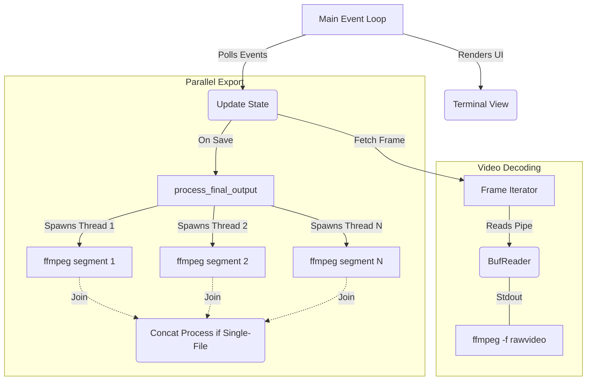

# RVE (Rust Video Editor)

A minimal, terminal-based video segment cutter written in Rust. It uses `ffmpeg` for processing and a custom differential renderer (with legacy `viuer` support) for in-terminal video playback.


## License

This project’s code is under the [MIT](https://choosealicense.com/licenses/mit/) license.

## Motivation

I had a bunch of NVIDIA shadowplay clips sitting around and needed a quicker way to do simple tasks like cutting out the important clip from 5-minute, multi-GB files. Fed up with the tedious import, mark, cut, export process with software like OBS or the inbuilt Windows editor (which would hang for multiple minutes on exporting), I built this.

## Features

- **In-Terminal Playback**: Uses a custom, high-performance differential ANSI renderer for default low-res playback, with legacy `viuer` support retained (includes high-res Kitty/iTerm protocols).
- **Two Display Modes**:
  - **Low-Res**: Fast, block-based rendering that works in most terminals.
  - **High-Res**: Pixel-based rendering using Kitty or iTerm graphics protocols (if supported).
- **Segment-Based Editing**:
  - Place markers (`v`) to define segments.
  - Toggle segments (`t`) for inclusion or exclusion in the final export.
- **Interactive Timeline**: A simple timeline shows the playhead, markers, and included/excluded segments.
- **Dual Output Modes**:
  - **Multi-File**: Exports each "included" segment as a separate video file.
  - **Single-File**: Concatenates all "included" segments into one continuous video file.
- **Non-Destructive**: All operations are non-destructive. Your original video file is never modified.

> [!WARNING]
>
> - It has **only been tested on Linux**.
> - It may **not build or run** on other platforms.
> - Terminal support for high-resolution playback (Kitty/iTerm) has not been tested by me, but I have heard that it works. Low-res mode is the default.
> - It does **not** process or preview audio. The final export (using `-c copy`) will preserve the original audio tracks.

## Requirements

Before you begin, you must have two external dependencies installed and available in your system's `PATH`:

1.  **ffmpeg**: Used for all video decoding, seeking, and segment exporting.
2.  **ffprobe**: Used to get video metadata (dimensions, duration, FPS).

You also need the **Rust toolchain** (e.g., `rustc` and `cargo`) to build the project.

## Building

1.  Clone the repository:

    ```bash
    git clone https://github.com/pbossev/rve.git
    cd rve
    ```

2.  Build the release binary:

    ```bash
    cargo build --release
    ```

3.  The final binary will be located at `target/release/rve`. You can copy this to a directory in your `PATH`:

    ```bash
    sudo cp target/release/rve /usr/local/bin/
    ```

## Usage

The binary is named `rve`. To run it, simply pass a video file as an argument:

```bash
rve /path/to/my_video.mp4
```

### CLI Arguments

Based on the `--help` menu:

- `<filepath>`: (Required) The path to the video file you want to edit.
- `--single-output`, `-s`: On exit, concatenate all "included" segments into one file (e.g., `filename_concat.mp4`). If omitted, it defaults to multi-file mode.
- `--high-res`, `-r`: Start the application in high-resolution pixel mode. This only works if your terminal (e.g., Kitty, WezTerm) supports the necessary graphics protocols, and `viuer` is selected as the renderer.
- `--help`, `-h`: Show the help menu.

## Keybinds

### Playback

| Key     | Action                       |
| :------ | :--------------------------- |
| `Space` | Play / Pause                 |
| `.`     | Next frame (when paused)     |
| `,`     | Previous frame (when paused) |

### Seeking

| Key                 | Action                        |
| :------------------ | :---------------------------- |
| `←` / `→`           | Seek -5s / +5s                |
| `Alt+←` / `Alt+→`   | Seek -30s / +30s              |
| `Ctrl+←` / `Ctrl+→` | Seek -60s / +60s              |
| `0-9`               | Jump to 0% - 90% of the video |

### Editing

| Key | Action                                                                    |
| :-- | :------------------------------------------------------------------------ |
| `v` | Place or remove a marker at the current playhead.                         |
| `t` | Toggle the current segment (between markers) as "Included" or "Excluded". |
| `[` | Jump to the previous marker.                                              |
| `]` | Jump to the next marker.                                                  |

### Application

| Key         | Action                                                                                                   |
| :---------- | :------------------------------------------------------------------------------------------------------- |
| `r`         | Toggle between **Low-Res** (block) and **High-Res** (pixel) display mode (only on compatible terminals). |
| `i`         | Toggle output mode between "Multi-File" and "Single-File".                                               |
| `?`         | Toggle the on-screen keybinding help display.                                                            |
| `s`         | **Save/output**. Suspends UI and begins the `ffmpeg` export process based on your segments.              |
| `q` / `Esc` | **Quit**. Prompts for confirmation before exiting without saving.                                        |

## Roadmap

I plan to develop this more as I get more time for it.

- [ ] Add basic audio preview support.
- [ ] Add basic audio editing support.
- [ ] Add multi-file importing.
- [ ] More advanced editing features (e.g., re-ordering segments, changing playback speed).

## Architecture & Concurrency

RVE is designed to be as non-blocking and fast as possible when dealing with video data. It relies on standard standard OS pipes to communicate with `ffmpeg` sub-processes, with no heavy C-bindings.



- **Frame Decoding**: When a video is opened, `rve` spawns an `ffmpeg` process that decodes the video into raw RGB24 frames. `FrameIterator` reads these frames directly into a pre-allocated pixel buffer using `std::mem::replace` to ensure zero-allocation per frame, achieving high throughput.
- **Parallel Export**: When you save, `rve` spawns a native OS thread for each segment you want to include. Each thread launches an `ffmpeg -c copy` subprocess. This allows multiple segments to be extracted from the source video concurrently, drastically speeding up the export.

## Benchmarks

RVE uses [Criterion.rs](https://bheisler.github.io/criterion.rs/book/index.html) to monitor performance regressions.

- **`frame_pipeline`**: Measures the raw throughput of pulling frames through the `BufReader` and constructing `image::RgbImage` structs. By reusing buffers, the overhead of the Rust pipeline is practically zero, bounded entirely by `ffmpeg`'s decode speed.
- **`export`**: Compares the speed of sequential vs parallel exporting. Due to the parallel threading architecture, exporting multiple segments concurrently yields significant speedups (e.g., a ~3.3x speedup when exporting 4 segments on modern hardware) since `ffmpeg` copy operations are largely I/O and stream-parse bound.
- **`renderer`**: Compares the custom differential terminal renderer against the legacy `viuer` renderer. The differential renderer tracks frame states and only writes ANSI escape codes for the exact pixels that change. This dramatically cuts down terminal I/O overhead, leading to massive real-world performance gains during static or low-motion scenes.

### Reference Results (Ryzen 5 5500 + RTX 3080)

| Benchmark        | Test                       | Time (avg) | Throughput | Notes                            |
| :--------------- | :------------------------- | :--------- | :--------- | :------------------------------- |
| `segment_export` | `sequential`               | ~399.65 ms | -          | 4 segments of 5 seconds each     |
| `segment_export` | `parallel`                 | ~115.80 ms | -          | ~3.45x speedup over sequential   |
| `frame_decode`   | `take_frame_lowres`        | ~40.23 ms  | ~24.85 fps | `rawvideo` pipe decode overhead  |
| `renderers`      | `differential_0_percent`   | ~33.58 µs  | -          | 0% frame change (static scene)   |
| `renderers`      | `differential_10_percent`  | ~108.13 µs | -          | 10% frame change                 |
| `renderers`      | `differential_100_percent` | ~690.87 µs | -          | 100% frame change (full redraw)  |
| `renderers`      | `viuer_renderer`           | ~692.38 µs | -          | Legacy renderer (see note below) |

_Note on `viuer_renderer`: The benchmark uses `gag` to intercept and suppress terminal stdout. In the real application, `viuer` redraws the entire frame and writes ~140KB of ANSI strings to the terminal every frame, causing massive terminal emulator lag. The differential renderer's true speedup comes from avoiding this I/O bottleneck._

You can run the benchmarks yourself with:

```bash
cargo bench
```
